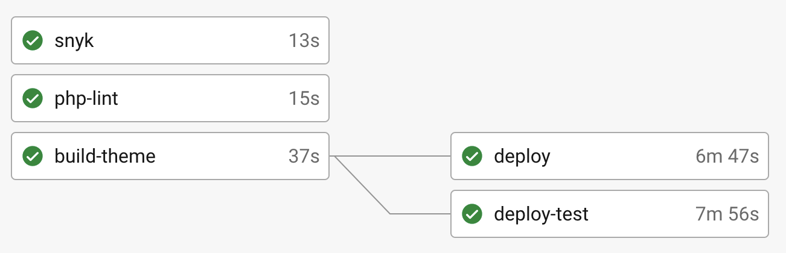

# DevOps Documentation

## Table of Contents

1. [Prerequisites](#prerequisites)
    1. [Administrative](#administrative)
    1. [Application](#application)
    1. [Data](#data)
    1. [Software](#software)
        1. [Debian/Ubuntu](#debianubuntu)
        1. [MacOS](#macos)
1. [Configurations](#configurations)
    1. [CircleCI](#circleci)
        1. [.circleci/config.yml](#circleciconfigyml)
        1. [Pipelines](#pipelines)
            1. [Deployment](#deployment)
            1. [Scheduled](#scheduled)
    1. [CloudFoundry](#cloudfoundry)
        1. [apt.yml](#aptyml)
        1. [manifest.yml](#manifestyml)
            1. [.bp-config/](#bp-config)
                1. [httpd/](#httpd)
                2. [php/](#php)
                3. [options.json](#optionsjson)
1. [Scripts](#scripts)
    1. [Application Scripts](#application-scripts)
        1. [bootstrap.sh](#bootstrapsh)
        1. [build_static](#build_static)
        1. [bash-exports.sh](#bash-exportssh)
        1. [post-deploy](#post-deploy)
    1. [Pipeline Scripts](#pipeline-scripts)
        1. [build-theme.sh](#build-themesh)
        1. [cloud-gov-deploy.sh](#cloud-gov-deploysh)
        1. [cloud-gov-login.sh](#cloud-gov-loginsh)
        1. [cloud-gov-remote-command.sh](#cloud-gov-remote-commandsh)
        1. [composer-install.sh](#composer-installsh)
        1. [deb-awscli.sh](#deb-awscli.sh)
        1. [deb-basic-deps.sh](#deb-basic-depssh)
        1. [deb-cf-install.sh](#deb-cf-installsh)
        1. [deb-mysql-client-install.sh](#deb-mysql-client-installsh)
        1. [downsync-backup.sh](#downsync-backupsh)
        1. [downsync-restore.sh](#downsync-restoresh)
        1. [exports.sh](#exportssh)
        1. [phpcs-install.sh](#phpcs-installsh)
        1. [scheduled-backup.sh](#scheduled-backupsh)
    1. [Miscellaneous Scripts](#miscellaneous-scripts)
        1. [download_latest_backup.sh](#download_latest_backupsh)

## Prerequisites

These are general tools and requirements needed to interact with the various scripts in this repository.

### Administrative

  - Cloud.gov Spaces

    The Cloud.gov spaces should already be created. This project uses:

      - dev
      - dmz
      - prod
      - stage
      - test

    The naming convention is typically: `{project_name}-{environment_name}`.

  ### Application

  Clone of both the [application](https://github.com/usagov/vote-gov-drupal/) and [terraform](https://github.com/usagov/vote-gov-tf/) repositories.

  ### Data

  Obtain a copy of the latest backup archive available. This will likely have been moved to Google Drive or some other storage.

  ### Software

  #### Debian/Ubuntu

[[top]](#devops-documentation)

  - awscli
  
    [Instructions](https://docs.aws.amazon.com/cli/latest/userguide/getting-started-install.html)
  
    ```
    curl "https://awscli.amazonaws.com/awscli-exe-linux-x86_64.zip" -o "awscliv2.zip"
    unzip awscliv2.zip
    sudo ./aws/install
    ```

  - CloudFoundry CLI v8
    
    [Instructions](https://docs.cloudfoundry.org/cf-cli/install-go-cli.html)
    
    ```
    wget -q -O - https://packages.cloudfoundry.org/debian/cli.cloudfoundry.org.key | sudo apt-key add -
    echo "deb https://packages.cloudfoundry.org/debian stable main" | sudo tee /etc/apt/sources.list.d/cloudfoundry-cli.list
    sudo apt-get update
    sudo apt-get install cf8-cli
    cf install-plugin https://github.com/cloud-gov/cf-service-connect/releases/download/1.1.0/cf-service-connect-darwin-amd64
    ```

  - jq

    ```
    sudo apt install jq
    ```

  - mysql-client

    ```
    apt-get install mysql-client
    ```

  - Terraform
    
    [Instructions](https://developer.hashicorp.com/terraform/tutorials/aws-get-started/install-cli)
    
    ```
    sudo apt-get update && sudo apt-get install -y gnupg software-properties-common
    wget -O- https://apt.releases.hashicorp.com/gpg | gpg --dearmor | sudo tee /usr/share/keyrings/hashicorp-archive-keyring.gpg
    gpg --no-default-keyring --keyring /usr/share/keyrings/hashicorp-archive-keyring.gpg --fingerprint
    echo "deb [signed-by=/usr/share/keyrings/hashicorp-archive-keyring.gpg] https://apt.releases.hashicorp.com $(lsb_release -cs) main" sudo tee /etc/apt/sources.list.d/hashicorp.list
    sudo apt update
    sudo apt-get install terraform
    ```

  [[top]](#devops-documentation)
  #### MacOS

  - Homebrew
    
    [Instructions](https://brew.sh)
    
    ```
    /bin/bash -c "$(curl -fsSL https://raw.githubusercontent.com/Homebrew/install/HEAD/install.sh)"
    ```
  
    NOTE: `sudo` rights are need on the laptop to install `homebrew`, otherwise permissions will be incorrect.
    
  - awscli
  
    [Instructions](https://docs.aws.amazon.com/cli/latest/userguide/getting-started-install.html)
  
    ```
    brew install awscli
    ```
    
  - CloudFoundry CLI v8
    
    [Instructions](https://docs.cloudfoundry.org/cf-cli/install-go-cli.html)
    
    ```
    brew install cloudfoundry/tap/cf-cli@8
    cf install-plugin https://github.com/cloud-gov/cf-service-connect/releases/download/1.1.0/cf-service-connect-darwin-amd64
    ```
    
  - coreutils
    
    ```
    brew install coreutils
    ```
     
  - jq
      
    ```
    brew install jq
    ```

  - mysql-client

    ```
    brew install mysql-client
    ```

  - Terraform
    
    [Instructions](https://developer.hashicorp.com/terraform/tutorials/aws-get-started/install-cli)
  
    ```
    brew tap hashicorp/tap
    brew install hashicorp/tap/terraform
    brew update
    brew upgrade hashicorp/tap/terraform
    ```

## [Configurations](#configurations)

[[top]](#devops-documentation)
### [CircleCI](#circleci)

This repository uses CircleCI as it's CI/CD pipeline. You can get to the project here:  [vote-gov-drupal](https://app.circleci.com/pipelines/github/usagov/vote-gov-drupal/).

#### .circleci/config.yml

This file contains the CircleCI `jobs` and `workflows` that make up the CI/CD pipeline. View the [Introduction to YAML Configurations](https://circleci.com/docs/introduction-to-yaml-configurations/) and [CircleCI configuration reference](https://circleci.com/docs/configuration-reference/) to learn more.

#### Deployment

The following are the workflows for deployments.  

`deploy-workflow` (`test` branch)

This workflow pushes to the `test` branch will deploy to the test environment alone.


`deploy-workflow`

This workflow is trigger after PR merges to `dev` and `stage` branches, due to these branches being protected branches. It will deploy the application to both the branch being merged to, as well as the `test` branch.



`deploy-workflow` (`prod` branch)

This workflow is trigger after PR merges to the `prod` branch requires authorized approval in CircleCI, before the workflow beings.


#### Scheduled Pipelines

`build-static-workflow`

This workflow will build the static site and copy it to the `static` site S3 bucket. It currently runs twice an hour.

`drush-cron-workflow`

This workflow will run the command `drush cron`. It current runs once an hour.

`scheduled-backup-workflow`

This work flow runs [scheduled-backup.sh](#scheduled-backupsh). This currently runs once an hour.

#### [.circleci/config.yml](#circleciconfigyml)

The configuration file for the CI/CD pipeline.

[[top]](#devops-documentation)
### [CloudFoundry](#cloudfoundry)

#### [apt.yml](#aptyml)

This yaml is read by the [apt buildpack](https://github.com/cloudfoundry/apt-buildpack) during the CloudFoundry staging process. It allows the installation of additional packages from Debian and Ubuntu repositories before the application is deployed.

In this repository, it is used to run an updated version of the NewRelic agent.

#### [manifest.yml](#manifestyml)

This yaml has the configuration for the actual application to be ran.

In this repository, it is used to deploy an instance of the Drupal CMS.

#### [.bp-config/](#bp-config)

This directory has additional configuration settings for the [php buildpack](https://github.com/cloudfoundry/php-buildpack).

##### [httpd/](#httpd)

This directory has configuration settings for Apache. 

  - `http.conf`: located in the root directory, this configuration file can be used to override global web server configuration options.
  - `user-provided/`: this directory holds additional configurations.
      - `httpd-drupalsupport.conf`: loads additional Apache modules for the Drupal instance to function.

##### [php/](#php)

This directory has configuration settings for PHP.

  - `php.ini.d/`: this directory automatically loads additional PHP settings during PHP initialization.
      - `extensions.ini`: this configuration file loads additional PHP modules required for the site to function. This includes `pdo_mysql` for MySQL connectivity and `sodium` (aka `libsodium`) for encryption support. To find additional modules that are supported, [check this file](https://github.com/cloudfoundry/php-buildpack/blob/master/manifest.yml). Scroll down the the version of PHP you are utilizing, and look for the `dependencies` section.
      - `memory_limit.ini`: this configuration file will set the maximum amount of memory that PHP can consume.

##### [options.json](#optionsjson)

This configuration includes additional bootstrapping options for the `php-buildpack`.

  - `PHP_VERSION`: This field uses a special variable (i.e. `{PHP_##_LATEST}`). For valid variable names, [check this file](https://github.com/cloudfoundry/php-buildpack/blob/master/defaults/options.json).
  - `ADDITIONAL_PREPROCESS_CMDS`: This array of strings are the paths to scripts to be ran before the system is deployed, during the staging process. Currently, this runs [bootstrap.sh](#bootstrapsh).


## Scripts

[[top]](#devops-documentation)
### Application Scripts

The are scripts that are ran in the application container while it's running in the cloud.gov environment.

#### bash-exports.sh

Can be used to export a variety of application variables. Not used for anything, but might be helpful for debugging.

#### bootstrap.sh

Runs configurations during the build pack staging. This includes things such as NewRelic configuration, setting of egress
proxy variables, and the installation of `awscli`.

#### build_static

Compiles the static website via the Drupal Tome module, then syncs the newly generated static files via `awscli` to S3. This script runs as a scheduled pipeline in CircleCI, where it is launched as a CloudFoundry task in cloud.gov.

#### post-deploy

Used to do post deployment house keeping tasks. These include various `drush` commands, such as running cache rebuild, config import, and the s3fs module tasks.

[[top]](#devops-documentation)
### Pipeline Scripts

These are the scripts that are to be utilized by the pipeline.

#### build-theme.sh

Installs gulp and builds the Drupal theme. It is launched in the `build-theme` job in the pipeline. The generated theme is stored in an attached workspace, then re-attached in deployment jobs to be uploaded with the build pack.

#### cloud-gov-deploy.sh

Deploys the Drupal application by pushing `manifest.yml`. The script uses the `envsubst` command to replace environment variables in `manifest.yml` with environment specific variables that are stored as CircleCI project variables.

After the application is deployed, it will setup network connections from the application to the egress proxy in the DMZ, as well as from the WAF to the application.

Finally, it uses `cf-cli` to launch two tasks, that are executed independently of the pipeline. The first is [post-deploy](#post-deploy). The script will wait for the `post-deploy` script to complete. The second task is [build_static](#build_static), which generates the static site. After generating the site, it will then upload the website to the static sites S3 bucket.

#### cloud-gov-login.sh

Logins into a cloud.gov organization and space using the pipeline credentials.

#### cloud-gov-remote-command.sh

Uses `cf-cli` to SSH to an application and run a command. Equivalent of `ssh USER@HOST 'COMMAND'`.

#### composer-install.sh

Installs the latest version of `composer`. Used in the pipeline to install the `php-lint` job.

#### deb-awscli.sh

Installs the `aws-cli` to the pipeline. Used for the [scheduled_backup.sh](#scheduled_backupsh) to transfer files between the various S3 buckets used.

#### deb-basic-deps.sh

Installs basic dependencies, like `envsubst` in the `gettext` package, used by several scripts. Additional basic dependencies that multiple scripts use can be added here.

#### deb-cf-install.sh

Installs the `cf-cli` binaries and dependencies. Used to run the CloudFoundry commands to interact with the cloud.gov platform.

#### deb-mysql-client-install.sh

Installs the `mysql-client` package. This is used for [downsync-backup.sh](#downsync-backupsh) and [downsync-restore.sh](#downsync-restoresh).

#### downsync-backup.sh

Launched by a `triggered pipeline` in CircleCI, that will connect to the database and executes the `mysqldump` command to get a current copy of the database running in an environment.

#### downsync-restore.sh

Launched by a `triggered pipeline` in CircleCI, that will connect to the database and executes the `mysql` command to restore a database running in an environment.

#### exports.sh

Certain variables are environmentally dependent. Examples are the application's memory and SSO certificates.

#### phpcs-install.sh

Installs PHP CodeSniffer for use with `php-lint`.

#### scheduled-backup.sh

Launched by a `triggered pipeline` in CircleCI, this scripts gathers all S3 bucket resources, along with a database back and packages them into a single archive.

[[top]](#devops-documentation)

### Miscellaneous Scripts

#### download_latest_backup.sh

Allows for easy downloading of the various backups available on the system. This includes the database backup, the Drupal user uploaded file content, and backups of the Terraform state.