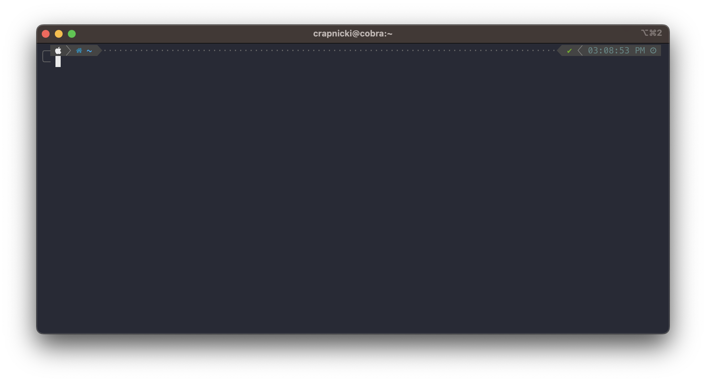
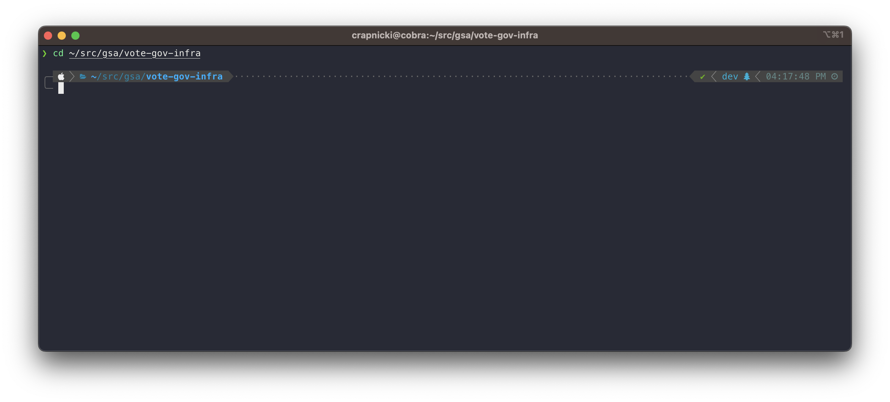
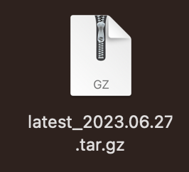
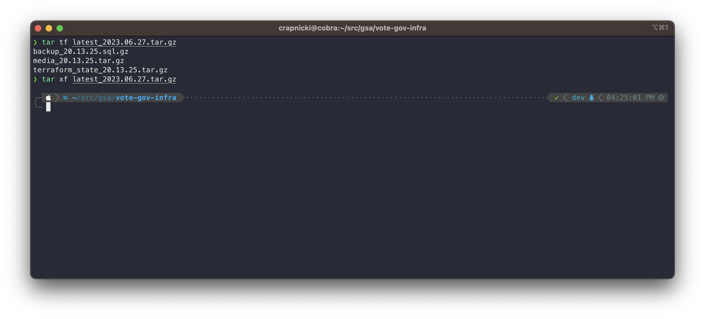
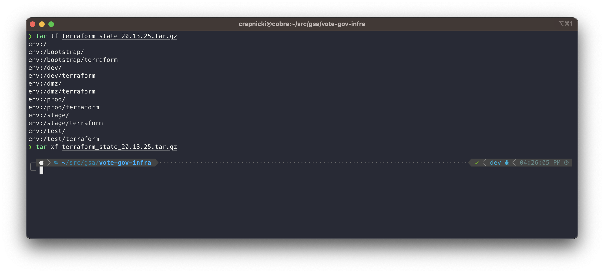
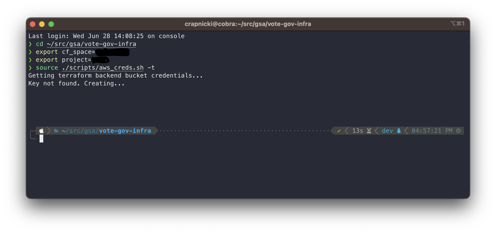
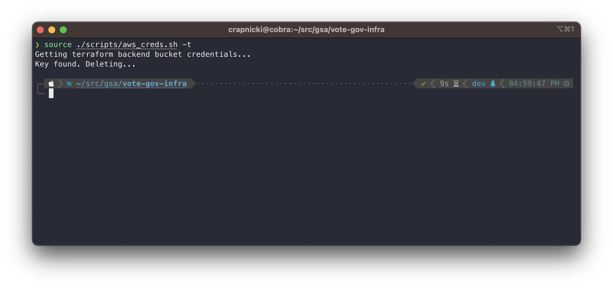
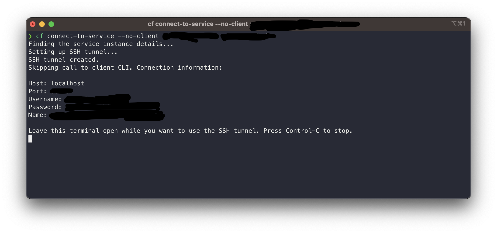

# Vote.gov Disaster Recovery

## Table of Contents

1. [Prerequisites](#prerequisites)
1. [Restore Process](#restore-process)
    1. [Initialization](#initialization)
    1. [Data Extraction](#data-extraction)
    1. [Terraform Restore Process](#terraform-restore-process)
    1. [Application Restore Process](#application-restore-process)
    1. [Database Restore Process](#database-restore-process)
    1. [Media Restore Process](#media-restore-process)

## Prerequisites

View the prerequisites and required tools for using scripts in the [devops.md](devops.md) file, in the `Prerequisites` section.

## Restore Process

  This section outlines the restoration process from a backup.

### Initialization

[[top]](#votegov-disaster-recovery)

1. Open a terminal window.



2. Change directory into the `terraform` repository.



3. Follow the instructions in the initialization section for the `README.md` in the `terraform` repository, running the `init.sh` script.
This step will create the pipeline accounts and various S3 buckets needed for the system to function.

### Data Extraction

[[top]](#votegov-disaster-recovery)

1. Download the latest copy of the backup archive. You can move this file to the `terraform` repository root folder for easier access.



2. Extract the data archive: `tar xf {archive_name}.tar.gz`. Three additional archives will be in the directory: `database`, `media`, and `terraform`.



### Terraform Restore Process

[[top]](#votegov-disaster-recovery)

**This process must happen in the context of the [Vote.gov Terraform Repository](https://github.com/usagov/vote-gov-tf)**

1. Extract the data archive: `tar xf {terraform_archive_name}.tar.gz`. This will create a new folder called `env:/`.



2. To restore the Terraform state files, AWS credentials need to be created.



  - NOTES:
    - {bucket_name}: The name of the name of the `terraform` bucket in Cloud.gov.
    - {cf_space}: The space where the bucket is deployed in Cloud.gov.

 ```
export bucket_name="{bucket_name}"
export cf_space="{cloudgov_space_name}"

source ./scripts/aws_creds.sh -t
```

Confirm `AWS` environmental variables have exported correctly:

```
env | sort | grep AWS
```

3. Upload the `terraform` state files to the `terraform` S3 bucket using `aws-cli`. The tool will display the progress of the file transfer.

```
aws s3 cp --recursive env:/ s3://${bucket}/env:/
```

4. Apply terraform in the prod workspace.

```
terraform workspace select prod
terraform apply
```

Repeat for the other environments (`dev`, `test`, `stage`) once prod is confirmed operational.

Each environment deployment will take 5 - 10 minutes to complete, with the database instance creation taking the longest.


5. Delete the `terraform` S3 credentials by running `aws_creds.sh` again.



### Application Restore Process

[[top]](#votegov-disaster-recovery)

1. Navigate to the prod branch in CircleCI.

2. Manually trigger a re-run of the most recent successful deploy workflow.

### Database Restore Process

[[top]](#votegov-disaster-recovery)

1. In a terminal window, change directory to the directory that has the database backup. The filename is `drupal_{timestamp}.sql.gz`.

2. Ensure that the environment has SSH enabled. The command `cf ssh {APP_NAME}` can be use to test if an SSH session can be created to the application. If it's disabled, like in `prod`, run the command below to enable it.

```
cf enable-ssh {APP_NAME}
```

3. Open a second terminal window, using it to create a secure tunnel through the application to the database service. This will display credentials required to connect to the database.



```
cf connect-to-service --no-client {APP_NAME} {DATABASE_SERVICE_NAME}
```

4. Using the credentials in the second window, from the command above, import the database. Depending on the database size, this process my take some time to complete.

```
gunzip < drupal_{timestamp}.sql.gz | mysql --host=127.0.0.1 --port={DATABASE_PORT} --protocol=TCP --user=${DATABASE_USERNAME} -p --database=${DATABASE_NAME}
```

Pressing enter will prompt for the database password.

5. At this point, deploying the application again would be helpful. Rerunning the last pipeline will force post-deployment steps and ensure the database doesn't have issues.

6. After confirming that the database is present, if SSH was enabled, disable it again.

```
cf disable-ssh {APP_NAME}
```

7. Use the `downsync` functionality in the pipeline to migrate the database to other environments.

### Media Restore Process

[[top]](#votegov-disaster-recovery)

Media files are user uploaded files, that were uploaded via the CMS. These can be a variety of files, such as PDF's, images, etc.

1. Change directory to the `terraform` repository.

  - NOTES:
    - {bucket_name}: The name of the name of the `static` bucket service in Cloud.gov.
    - {cf_space}: The space where the bucket is deployed in Cloud.gov.

 ```
  export bucket_name="{bucket_name}"
  export cf_space="{cloudgov_space_name}"

  source ./scripts/aws_creds.sh -s
  ```

2. Extract the media files: `tar xf media_{timestamp}.tar.gz`

Confirm `AWS` environmental variables have exported correctly:

```
env | sort | grep AWS
```

3. Upload the `media` files to the `static` S3 bucket using `aws-cli`. The tool will display the progress of the file transfer.

```
aws s3 cp --recursive cms/ s3://${bucket}/cms/
```

4. Repeat the steps above for other environments.
